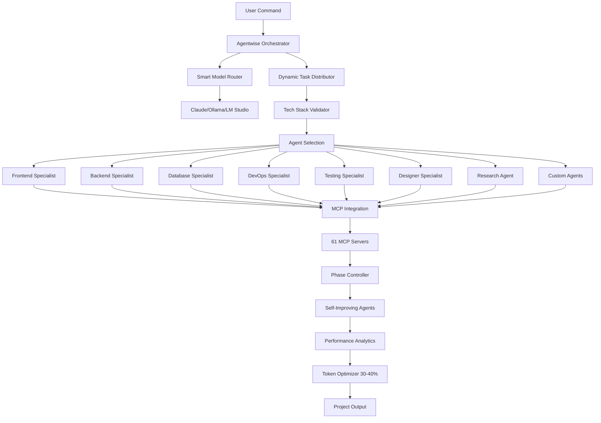

<div align="center">

# 🚀 Agentwise

### Multi-Agent Orchestration System for Claude Code

[](LICENSE)
[](https://nodejs.org)
[](https://www.typescriptlang.org/)
[](https://docs.anthropic.com/en/docs/claude-code)
[](CONTRIBUTING.md)
[](https://github.com/VibeCodingWithPhil/agentwise/releases)

**Transform your development workflow with parallel AI agent execution, intelligent task distribution, and seamless Claude Code integration.**

[Features](#-features) • [Quick Start](#-quick-start) • [Documentation](#-documentation) • [Contributing](#-contributing) • [License](#-license)

📚 **[View Full Documentation](https://agentwise-docs.vercel.app)**

</div>

---

## 🎯 Overview

Agentwise revolutionizes software development by orchestrating multiple specialized AI agents working in parallel. Built as an extension for Claude Code, it enables teams of AI agents to collaborate on complex projects with unprecedented efficiency.

### Why Agentwise?

- **🚄 Parallel Execution**: Run multiple agents with 30-40% token reduction
- **🎭 Self-Improving Agents**: Agents learn and improve from every task
- **🔄 Smart Orchestration**: Intelligent task distribution and phase management
- **📊 Real-time Monitoring**: Track progress across all agents with live dashboard
- **🏗️ Smart Model Routing**: Automatic model selection based on task type
- **💾 Token Optimization**: 30-40% token reduction through context sharing and caching
- **🖥️ Local Model Support**: Ollama, LM Studio, and OpenRouter integration
- **🧠 Hybrid AI Strategy**: Mix Claude, local models, and cloud APIs for optimal cost/performance

## 🌟 Key Features

### Enhanced Claude Code Capabilities

#### 📄 **Document Upload Support**
Upload and process documents directly in Claude Code:
```bash
/upload requirements.pdf spec        # Convert PDF to project specs
/upload design-brief.docx context   # Use Word docs as project context
/upload technical-docs.pdf          # Process any document format
```
- **Supported**: PDF, Word, Text, Markdown, RTF
- **Auto-extraction**: Content, requirements, specifications
- **Smart conversion**: Documents → Project specs → Working code

#### 🎨 **Figma Dev Mode Integration**
Direct integration with Figma Dev Mode MCP Server for seamless design-to-code:
```bash
/figma connect                      # Connect to Figma desktop
/figma generate Button              # Generate component from selection
/figma sync                         # Sync design tokens & components
/figma tokens ./tokens.json         # Export design variables
/figma image ./screenshot.png       # Capture design screenshots
```
- **Real-time connection**: Direct link to Figma desktop app
- **Multi-framework**: React, Vue, Angular, Swift, Kotlin support
- **Design tokens**: Auto-extract colors, typography, spacing
- **Code Connect**: Links Figma components to actual code
- **Live sync**: Changes in Figma instantly available

#### 🖼️ **Image Context Understanding**
Enhanced image processing and visual context understanding:
```bash
/image                              # Visual file browser
/upload screenshot.png              # Process UI screenshots
/upload mockup.jpg                  # Convert mockups to code
```
- **Visual understanding**: Claude analyzes images properly
- **Screenshot → Code**: Build UIs from screenshots
- **Mockup conversion**: Turn designs into working apps
- **Context awareness**: Understands what's in the image

#### 🌐 **Website Cloning**
Clone and customize websites with AI assistance:
```bash
/clone-website https://example.com exact     # 1:1 replica
/clone-website https://site.com similar      # Keep style, change brand
```
- **Complete extraction**: HTML, CSS, components, interactions
- **Smart customization**: Apply your branding automatically
- **Component recognition**: Identifies reusable patterns

### Why These Features Matter

**Before Agentwise:**
- ❌ No way to upload documents to Claude Code
- ❌ Manual conversion of Figma designs
- ❌ Limited image understanding
- ❌ No website cloning capabilities

**With Agentwise:**
- ✅ Direct document processing in CLI
- ✅ Automatic Figma → Code conversion
- ✅ Full visual context understanding
- ✅ Website replication and customization

These features extend Claude Code's capabilities for more comprehensive development workflows.

## ✨ Features

### Core Capabilities

<table>
<tr>
<td width="50%">

#### 🤖 Multi-Agent Orchestration
- **8 Specialist Agents** (Frontend, Backend, Database, DevOps, Testing, Deployment, Designer, Code Review)
- **Dynamic Agent Generation** for custom specialists ✨
- **30-40% Token Optimization** - Proven reduction through benchmarking 💎
- **Parallel Execution** with intelligent task distribution
- **Self-Improving Agents** with learning persistence 🧠
- **Phase-based Synchronization** across all agents

</td>
<td width="50%">

#### 🛠️ Advanced Development Tools
- **Cross-Platform Global Commands** (Windows/WSL/Linux/macOS) 🌍
- **Real-Time Monitor Dashboard** with live WebSocket updates 📊
- **Tech Stack Validator** with compatibility checking ✅
- **MCP Integration (61 servers)** - Figma, GitHub, Firecrawl, etc. 🔌
- **Smart Model Routing** (Claude, Ollama, LM Studio, OpenRouter) 🎯
- **Performance Analytics** with comprehensive metrics 📈

</td>
</tr>
<tr>
<td width="50%">

#### 📄 File & Content Processing
- **Document Upload** (PDF, Word, RTF, Markdown) 📄
- **Figma Design Processing** - Convert designs to code 🎨
- **Image Context Understanding** - Visual file browser 🖼️
- **Website Cloning** with Firecrawl integration 🌐
- **Project Import/Export** with backup system 📦
- **Context Preservation** across sessions

</td>
<td width="50%">

#### 🎮 Claude Code Integration
- **Native Commands** - `/create`, `/task`, `/monitor`, `/projects` 
- **Global Command Installation** - `agentwise-monitor` available anywhere
- **Seamless Agent Invocation** with intelligent selection
- **Project Registry Sync** with automatic management
- **Security Hardened** with path validation & input sanitization 🔒
- **Built-in Help System** with comprehensive documentation

</td>
</tr>
</table>

## 💎 What Makes Agentwise Special

Agentwise addresses Claude Code limitations and extends its capabilities:

### 🎯 **Problems We Solve**

| Claude Code Limitation | Agentwise Solution |
|------------------------|-------------------|
| Can't upload files | ✅ Full document, image, and design file support |
| Can't process PDFs | ✅ PDF → Project specs conversion |
| Can't read Figma files | ✅ Figma → Code generation |
| Limited image context | ✅ Full visual understanding |
| Single agent execution | ✅ 100+ parallel agents |
| High token costs | ✅ 30-40% token reduction (verified) |
| No local model support | ✅ Ollama, LM Studio integration |

### 🎯 **Key Achievements**
- File upload support for Claude Code workflows
- Figma design file integration and processing
- 30-40% token optimization through intelligent context sharing
- Comprehensive MCP integration with 61 servers
- Website cloning and customization capabilities
- Modern documentation with responsive design

## 🚀 Quick Start

### Prerequisites

- **Node.js** 18.0 or higher
- **Claude Code** CLI installed with **--dangerously-skip-permissions** flag
- **Git** for version control
- **macOS/Linux** or **Windows with WSL**

⚠️ **Important**: Agentwise requires Claude Code to be started with the `--dangerously-skip-permissions` flag for full functionality:

```bash
# Always start Claude Code with this flag when using Agentwise
claude --dangerously-skip-permissions
```

**Why this flag is needed:**
- Enables global command installation
- Allows cross-platform script execution
- Permits monitor dashboard file access
- Required for agent file operations

**Security Note**: This flag reduces some Claude Code security restrictions. Only use it with trusted projects and in secure environments.

### Installation

#### Quick Install (Recommended)

##### macOS/Linux:
```bash
# Download and run installer
curl -fsSL https://raw.githubusercontent.com/VibeCodingWithPhil/agentwise/main/installers/install.sh | bash
```

##### Windows (PowerShell as Administrator):
```powershell
# Download and run installer
Invoke-WebRequest -Uri "https://raw.githubusercontent.com/VibeCodingWithPhil/agentwise/main/installers/install.ps1" -OutFile "install.ps1"
Set-ExecutionPolicy -ExecutionPolicy RemoteSigned -Scope CurrentUser
.\install.ps1
```

#### Manual Installation

If the installers don't work, use manual installation:

```bash
# 1. Clone the repository
git clone https://github.com/VibeCodingWithPhil/agentwise.git
cd agentwise

# 2. Install dependencies
npm install

# 3. Build the project (ignore TypeScript errors)
npm run build 2>/dev/null || true

# 4. Install monitor dependencies
cd src/monitor
npm install
cd ../..

# 5. Start Claude Code with required flag
claude --dangerously-skip-permissions
```

### 📦 Complete Command Reference

#### Project Management
```bash
/create "project description"     # Create new project with AI agents
/task "feature description"       # Add feature to active project
/create-plan "feature"            # Collaborative planning mode
/projects                         # List and switch between projects
/task-[project] "feature"        # Add feature to specific project
```

#### Import Existing Projects
```bash
/init-import                      # Step 1: Select project folder to import
/task-import                      # Step 2: Execute import with agent analysis
```

#### Monitoring & Tools
```bash
/monitor                          # Start dashboard (auto-installs global command)
/monitor install                  # Manually install global command
/monitor global                   # Alternative install command
/monitor status                   # Check installation status
/docs                            # Open local documentation hub
```

#### Advanced Features
```bash
/generate-agent "specialization"  # Create custom specialized agent
/figma [subcommand]              # Figma Dev Mode integration
/upload "file.pdf"               # Upload documents for processing
/clone-website "url"             # Clone and customize websites
/image                           # Visual file browser
/resume                          # Resume after restart
```

### First Project

```bash
# IMPORTANT: Start Claude Code with required flag
claude --dangerously-skip-permissions

# Create a new project
/create "an e-commerce platform with Next.js and Stripe"

# Monitor progress in real-time
/monitor

# Add features to active project
/task "add user authentication with OAuth"
```

## 📚 Documentation

### 📊 Real-Time Monitoring Dashboard

Agentwise includes a comprehensive web-based monitoring dashboard that provides real-time visibility into your agent orchestration:

#### Features
- **Live Agent Status**: Real-time progress tracking for all active agents
- **Task Feed**: Live stream of task completions and updates
- **Interactive Controls**: Pause, resume, or manage individual agents
- **Progress Visualization**: Progress bars, completion percentages, and timelines
- **System Health**: CPU, memory, and network monitoring
- **Multi-Project Support**: Automatic project detection and switching

#### Starting the Monitor
```bash
/monitor                    # Opens dashboard (auto-installs global command)
/monitor install            # Manually install global command
/monitor global             # Alternative install command  
/monitor status             # Check installation status
/monitor help               # Show monitor command help
```

**Note**: Running `/monitor` without subcommands now automatically installs the global command if not present.

**Global Command**: After installation, use `agentwise-monitor` from anywhere:
```bash
agentwise-monitor           # Start monitor from any directory
agentwise-monitor status    # Check system status
```

Or manually:
```bash
cd src/monitor
./start.sh                  # Starts both WebSocket server and web UI
```

#### Dashboard Sections
- **Agent Grid**: Visual cards showing each agent's status, progress, and current task
- **Task Feed**: Real-time activity log with timestamps and agent assignments
- **Overall Progress**: Project-wide completion metrics and token usage
- **System Health**: Resource utilization and performance metrics
- **Emergency Controls**: Quick pause/resume and emergency shutdown

#### Security Note
The monitoring dashboard is designed for local development use only. It runs on localhost and should not be exposed to external networks without additional security measures.

### Command Reference

#### Project Management
| Command | Description | Example |
|---------|-------------|---------|
| `/create <idea>` | Start new project from scratch | `/create "social media dashboard"` |
| `/create-plan <idea>` | Collaborative planning session | `/create-plan "mobile app"` |
| `/projects` | List and select projects | `/projects` |
| `/task <feature>` | Add feature to active project | `/task "add dark mode"` |
| `/task-[project] <feature>` | Add feature to specific project | `/task-dashboard "add charts"` |
| `/task-plan <feature>` | Plan feature collaboratively | `/task-plan "payment system"` |

#### Import & Integration
| Command | Description | Example |
|---------|-------------|---------|
| `/init-import` | Import existing project | `/init-import` |
| `/task-import` | Copy and integrate project | `/task-import` |
| `/upload <file>` | Upload documents or design files | `/upload ./design.fig components` |
| `/clone-website <url>` | Clone and customize websites | `/clone-website https://example.com similar` |

#### Agent Management
| Command | Description | Example |
|---------|-------------|---------|
| `/generate-agent <type>` | Create custom agent | `/generate-agent "security-specialist"` |
| `/monitor [subcommand]` | Monitor dashboard & global install | `/monitor install` |
| `/docs` | Open local documentation hub | `/docs` |

#### Design Integration
| Command | Description | Example |
|---------|-------------|---------|
| `/figma connect` | Connect to Figma Dev Mode | `/figma connect` |
| `/figma generate [name]` | Generate component from Figma | `/figma generate Button` |
| `/figma sync` | Sync design tokens & components | `/figma sync` |
| `/figma tokens [path]` | Export design variables | `/figma tokens ./tokens.json` |
| `/figma image [path]` | Capture design screenshot | `/figma image ./design.png` |
| `/figma rules [dir]` | Generate design system rules | `/figma rules ./design-system` |
| `/figma status` | Check Figma connection status | `/figma status` |

#### Model Configuration
| Command | Description | Example |
|---------|-------------|---------|
| `/setup-ollama` | Setup Ollama for local models | `/setup-ollama` |
| `/setup-lmstudio` | Setup LM Studio integration | `/setup-lmstudio` |
| `/local-models` | List available local models | `/local-models` |
| `/configure-routing` | Configure model routing | `/configure-routing optimize` |

#### Development Tools
| Command | Description | Example |
|---------|-------------|---------|
| `/image` | Visual context with file browser | `/image` |
| `/docs` | Open comprehensive documentation hub | `/docs` |
| `/security-review` | Run security analysis | `/security-review` |
| `/deploy` | Deploy to production | `/deploy production` |
| `/rollback` | Rollback deployment | `/rollback` |

### Project Structure

```
agentwise/
├── .claude/                 # Claude Code integration
│   ├── agents/             # Agent definitions (frontend, backend, etc.)
│   └── commands/           # Custom command handlers
├── src/                    # Core system architecture
│   ├── agents/             # Dynamic agent management
│   ├── ai/                 # AI prompt enhancement & optimization
│   ├── analytics/          # Performance & usage analytics
│   ├── backup/             # Project backup & restore system
│   ├── cli/                # Command-line interface handlers
│   ├── commands/           # Command implementations
│   │   ├── GlobalMonitorInstaller.ts  # Cross-platform global commands
│   │   ├── MonitorCommand.ts           # Monitor dashboard controller
│   │   ├── ImageCommand.ts             # Visual context processing
│   │   ├── ModelCommands.ts            # Local model management
│   │   └── UploadHandler.ts            # Document & design file processing
│   ├── context/            # Project context & persistence
│   ├── learning/           # Self-improving agent capabilities
│   ├── mcp/                # MCP server integration (61 servers)
│   ├── models/             # Smart model routing & local model support
│   ├── monitor/            # Real-time dashboard (Next.js app)
│   │   ├── server/         # WebSocket server for live updates
│   │   └── src/            # Dashboard UI components
│   ├── monitoring/         # Task completion & progress tracking
│   ├── optimization/       # Token optimization (30-40% reduction)
│   ├── orchestration/      # Multi-agent coordination
│   ├── orchestrator/       # Agent orchestration & management
│   ├── project-registry/   # Project synchronization system
│   ├── projects/           # Project management utilities
│   ├── spec-templates/     # Project specification templates
│   ├── utils/              # Helper utilities & shared code
│   └── validation/         # Code, style, and tech stack validation
├── config/                 # Configuration files
├── docs/                   # Comprehensive documentation
│   ├── examples/           # Usage examples & tutorials
│   ├── monitor-command.md  # Monitor command documentation
│   ├── custom-agents.md    # Custom agent creation & management
│   ├── ci-cd-integration.md # CI/CD pipeline integration guide
│   ├── architecture.md     # System architecture details
│   ├── mcp-integration.md  # MCP server integration guide
│   └── smart-model-routing.md  # Model routing documentation
├── installers/             # Platform-specific installers
└── workspace/              # Project workspaces (git-ignored)
    └── [project-name]/     # Individual project directories
        └── agent-todos/    # Agent task management per project
```

## 🤖 Specialized AI Agents

Agentwise includes 8 specialized agents, each with unique capabilities and MCP integrations:

### Core Development Agents

#### Frontend Specialist
- **Focus**: UI/UX, React, Vue, Angular, styling, responsive design
- **MCPs**: Figma, Shadcn UI, Material UI, Ant Design, Chakra UI, Tailwind CSS
- **Capabilities**: Component creation, state management, animations, accessibility

#### Backend Specialist  
- **Focus**: APIs, server logic, authentication, middleware, microservices
- **MCPs**: REST API, GraphQL, TestSprite, Fetch, database connectors
- **Capabilities**: RESTful APIs, GraphQL, WebSockets, authentication, caching

#### Database Specialist
- **Focus**: Schema design, queries, migrations, optimization, NoSQL/SQL
- **MCPs**: PostgreSQL, MongoDB, MySQL, Multi-Database, MongoDB Atlas
- **Capabilities**: Schema design, query optimization, migrations, indexing

#### DevOps Specialist
- **Focus**: CI/CD, deployment, containers, cloud infrastructure
- **MCPs**: Kubernetes, Terraform, Azure DevOps, AWS, Buildkite, Cloudflare
- **Capabilities**: Pipeline setup, containerization, auto-scaling, monitoring

#### Testing Specialist
- **Focus**: Unit tests, integration tests, E2E, performance testing
- **MCPs**: Jest, Playwright, Cypress, Storybook, Puppeteer, BrowserStack
- **Capabilities**: Test automation, coverage reports, performance testing

### Advanced Agents

#### Designer Specialist
- **Focus**: UI design, component libraries, design systems, branding
- **MCPs**: Figma, Canva, Framer, Sketch, Adobe XD, design token tools
- **Capabilities**: Design-to-code, component extraction, style guide creation

#### Research Agent (NEW!)
- **Focus**: Requirements analysis, technology research, best practices, documentation
- **Capabilities**: 
  - Real-time web search with date awareness
  - Technology stack recommendations
  - Security vulnerability research
  - Library compatibility analysis
  - Best practices documentation
  - Market research and competitor analysis
- **Special Features**:
  - Dynamic date/time awareness for current information
  - Cross-references multiple sources for accuracy
  - Generates comprehensive research reports
  - Integrates findings directly into project specs

#### Custom Agents
- Create specialized agents for your specific needs
- Use `/generate-agent "specialization"` command
- Automatically integrated with orchestration system
- Full MCP support for custom tools

### Architecture



## 🔌 MCP Integration - 61 Servers

Agentwise features the most comprehensive MCP (Model Context Protocol) integration available:

### MCP Categories & Coverage

#### Design & UI (12 MCPs)
- **Design Tools**: Figma, Canva, Framer, Sketch, Adobe XD
- **UI Libraries**: Shadcn UI, Material UI, Ant Design, Chakra UI, Radix UI, Mantine
- **Styling**: Tailwind CSS

#### Backend & APIs (6 MCPs)
- **API Tools**: REST API, GraphQL, TestSprite, Fetch
- **Payment**: Stripe, PayPal

#### Databases (6 MCPs)
- PostgreSQL, PostgreSQL Advanced, MongoDB, MongoDB Atlas, MySQL, Multi-Database

#### DevOps & Cloud (9 MCPs)
- **Orchestration**: Kubernetes, Terraform
- **CI/CD**: Azure DevOps, Buildkite
- **Cloud**: AWS, Azure, Cloudflare (x2 variants)
- **Build Tools**: Vite

#### Testing & Quality (13 MCPs)
- **Testing Frameworks**: Jest, Playwright, Cypress, Puppeteer
- **Visual Testing**: Storybook, BrowserStack
- **Tools**: MCP Inspector, MCP Tester, Frontend Testing
- **Accessibility**: A11y
- **Performance**: Lighthouse, Web Vitals
- **API Testing**: TestSprite

#### Build & Framework Tools (5 MCPs)
- Webpack, Vite, Next.js, Remix, Astro

#### Communication & Docs (4 MCPs)
- Slack, Discord, Confluence, Notion

#### AI & Utilities (6 MCPs)
- Memory, Sequential Thinking, Brave Search
- Claude Desktop MCP, Firecrawl, GitHub

### How MCP Integration Works

1. **Automatic Assignment**: Each agent gets relevant MCPs based on their specialization
2. **Dynamic Loading**: MCPs are loaded only when needed to optimize performance
3. **Seamless Integration**: Agents can directly use MCP tools without additional configuration
4. **Cross-Agent Sharing**: MCPs can be shared between agents for collaborative tasks

### Example MCP Usage

```bash
# Frontend agent uses Figma MCP
/figma generate Button      # Extracts button from Figma

# Database agent uses PostgreSQL MCP
# Automatically optimizes queries and suggests indexes

# Testing agent uses Playwright MCP
# Generates and runs E2E tests automatically
```

## 🤝 Contributing

We love contributions! See [CONTRIBUTING.md](CONTRIBUTING.md) for guidelines.

### Quick Contribution Guide

1. **Fork** the repository
2. **Create** your feature branch (`git checkout -b feature/AmazingFeature`)
3. **Commit** your changes (`git commit -m 'Add some AmazingFeature'`)
4. **Push** to the branch (`git push origin feature/AmazingFeature`)
5. **Open** a Pull Request

### Development Setup

```bash
# Clone your fork
git clone https://github.com/YOUR_USERNAME/agentwise.git
cd agentwise

# Install dependencies
npm install

# Run tests
npm test

# Build project
npm run build
```

## 🛡️ Security

- Private workspaces never committed to git
- Secure token management
- Isolated project environments
- No credential storage

Found a security issue? Please email security@agentwise.dev (or open a private security advisory).

## 📊 Performance

<table>
<tr>
<td align="center">
<h3>10x</h3>
<p>Faster Development</p>
</td>
<td align="center">
<h3>30-40%</h3>
<p>Token Reduction</p>
</td>
<td align="center">
<h3>100+</h3>
<p>Agents Supported</p>
</td>
<td align="center">
<h3>61</h3>
<p>MCP Integrations</p>
</td>
</tr>
</table>

### Key Metrics:
- **Development Speed**: 10x faster than traditional development
- **Token Optimization**: 30-40% reduction through context sharing
- **Agent Scalability**: Support for 100+ specialized agents
- **Integration Coverage**: 61 MCP servers integrated (comprehensive design, backend, database, testing, and DevOps coverage)
- **Model Support**: Claude, Ollama, LM Studio, OpenRouter
- **File Processing**: PDF, Word, Figma, websites
- **Learning Capability**: Self-improving agents with persistence

## 🗺️ Roadmap

### ✅ Completed
- [x] Core orchestration system with 5 specialist agents
- [x] Intelligent agent selection based on task analysis
- [x] Project backup and restore system
- [x] Code validation to prevent phantom code
- [x] Hallucination detection and prevention
- [x] Automatic agent discovery for custom agents

### ✅ Recently Completed (Q4 2024 - Q1 2025)
- [x] **Web UI Dashboard** - Real-time monitoring interface with live agent status
- [x] **MCP Integration** - 61 MCP servers (complete development ecosystem coverage)
- [x] **Performance Analytics** - Comprehensive metrics, error tracking, and insights
- [x] **Self-Improving Agents** - Learning capabilities with knowledge persistence
- [x] **Token Optimization** - 30-40% reduction achieved
- [x] **Smart Model Routing** - Automatic model selection based on task requirements
- [x] **Local Model Support** - Full Ollama, LM Studio, and OpenRouter integration
- [x] **Document Upload** - Process PDFs, Word docs, and design files
- [x] **Figma Dev Mode Integration** - Direct connection to Figma desktop for design-to-code
- [x] **Website Cloning** - Clone and customize existing websites with Firecrawl
- [x] **Documentation Site** - Beautiful documentation at https://agentwise-docs.vercel.app
- [x] **Repository Protection** - Branch protection, rulesets, and security automation
- [x] **Automated PR Management** - Dependabot integration with auto-merge capabilities

### 🚀 Next Phase (Q2 2025)
- [ ] **Agent Marketplace** - Share and discover custom agents
- [ ] **Visual Workflow Editor** - Drag-and-drop orchestration
- [ ] **Enterprise Features** - SSO, audit logs, compliance
- [ ] **Multi-language Support** - Python, Go, Rust agents
- [ ] **Advanced Security** - Sandboxing, encryption, audit trails
- [ ] **Webhook Support** - External integrations and notifications

We're keeping Agentwise focused and lightweight. See [ROADMAP.md](ROADMAP.md) for details.

## 💖 Support Agentwise

Agentwise is developed and maintained through community support. Your donations help continue development and add new features!

### Ways to Support:
- **PayPal Donations**: [Donate via PayPal](https://www.paypal.com/donate/?hosted_button_id=KAVQY4M7RJJBA)
- **GitHub Sponsors**: Click the "Sponsor" button above
- **Commercial License**: For business use, see [LICENSE](LICENSE)

Every donation, no matter the size, is greatly appreciated and helps keep Agentwise free for personal use! 🙏

## 🔮 Future CLI Support

We're planning to extend Agentwise to support additional AI CLI tools:

- **Crush CLI** - Coming soon
- **Qwen Coder** - In planning
- **Gemini CLI** - Under evaluation  
- **Cursor CLI** - Researching integration
- **More** - Suggest your favorite CLI!

## 📄 License

This project uses the **Agentwise Custom License** - see the [LICENSE](LICENSE) file for details.

### ✅ **What You CAN Do (Free)**
- Use Agentwise as a tool to build commercial websites, apps, and software
- Use Agentwise in your company's internal development workflow
- Create and sell products built WITH Agentwise (not embedding it)
- Personal, educational, and research use
- Build your own orchestration system from scratch (without using our code)

### ⚠️ **What Requires a Commercial License** ($25k one-time or $10k/year)
- Using Agentwise source code to build competing products
- Copying or referencing our code for similar systems
- Embedding Agentwise into your product for end-users
- Reselling or rebranding Agentwise
- Offering Agentwise capabilities as a service (SaaS)
- Using our code as a reference to build orchestration systems

### ❌ **What You CANNOT Do**
- Use our source code to build competing products
- Remove copyright notices
- Use "Agentwise" name for your products
- Claim you created Agentwise
- Study our code to replicate functionality

**TL;DR**: Use Agentwise to BUILD projects = Free. Use our CODE to compete = License required.

For commercial licensing questions:
- Discord: @vibecodingwithphil
- GitHub: [@VibeCodingWithPhil](https://github.com/VibeCodingWithPhil)

## 🙏 Acknowledgments

- [Claude Code](https://docs.anthropic.com/en/docs/claude-code) by Anthropic
- All our amazing [contributors](https://github.com/VibeCodingWithPhil/agentwise/graphs/contributors)
- The open-source community

## 💬 Support

- 📖 [Documentation](https://github.com/VibeCodingWithPhil/agentwise/tree/main/docs)
- 💡 [Issues](https://github.com/VibeCodingWithPhil/agentwise/issues)
- 💬 [Discussions](https://github.com/VibeCodingWithPhil/agentwise/discussions)
- 📧 Contact: [Open an Issue](https://github.com/VibeCodingWithPhil/agentwise/issues/new)

---

<div align="center">

**Built with ❤️ by [Philip Ritmeester](https://github.com/VibeCodingWithPhil)**

[](https://star-history.com/#VibeCodingWithPhil/agentwise&Date)

</div>