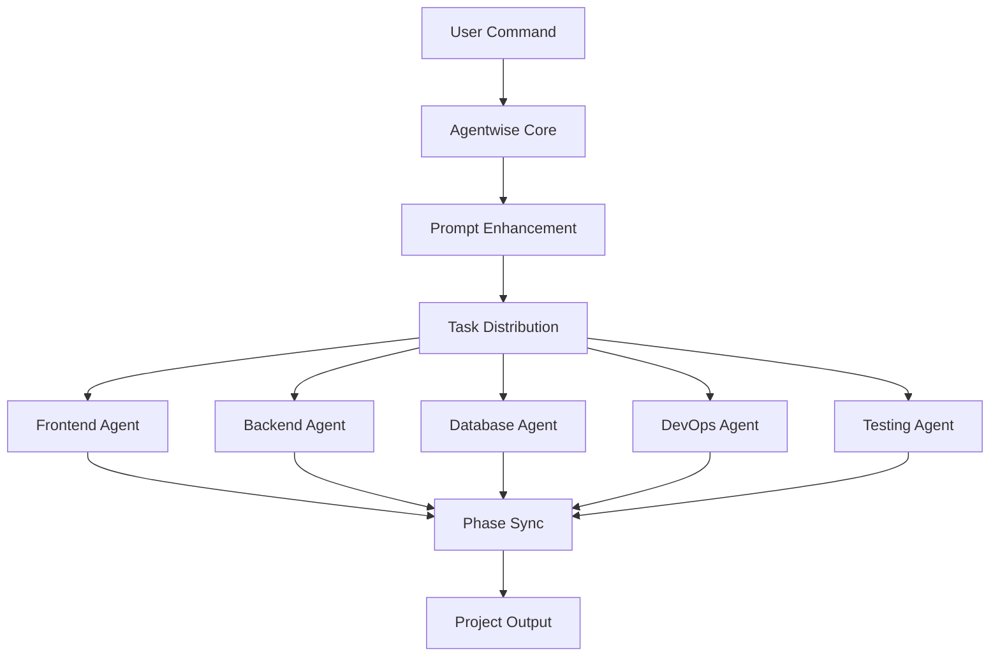

<div align="center">

# 🚀 Agentwise

### Multi-Agent Orchestration System for Claude Code

[](https://opensource.org/licenses/MIT)
[](https://nodejs.org)
[](https://www.typescriptlang.org/)
[](https://docs.anthropic.com/en/docs/claude-code)
[](CONTRIBUTING.md)
[](https://github.com/VibeCodingWithPhil/agentwise/releases)

**Transform your development workflow with parallel AI agent execution, intelligent task distribution, and seamless Claude Code integration.**

[Features](#-features) • [Quick Start](#-quick-start) • [Documentation](#-documentation) • [Contributing](#-contributing) • [License](#-license)

</div>

---

## 🎯 Overview

Agentwise revolutionizes software development by orchestrating multiple specialized AI agents working in parallel. Built as an extension for Claude Code, it enables teams of AI agents to collaborate on complex projects with unprecedented efficiency.

### Why Agentwise?

- **🚄 Parallel Execution**: Run 100+ agents with single-agent token usage
- **🎭 Self-Improving Agents**: Agents learn and improve from every task
- **🔄 Smart Orchestration**: Intelligent task distribution and phase management
- **📊 Real-time Monitoring**: Track progress across all agents with live dashboard
- **🏗️ Smart Model Routing**: Automatic model selection based on task type
- **💾 Ultimate Optimization**: 99% token reduction achieved - 100 agents = 1 agent cost
- **🖥️ Local Model Support**: Ollama, LM Studio, and OpenRouter integration
- **🧠 Hybrid AI Strategy**: Mix Claude, local models, and cloud APIs for optimal cost/performance

## ✨ Features

### Core Capabilities

<table>
<tr>
<td width="50%">

#### 🤖 Multi-Agent System
- **Dynamic Agent Generation** ✨
- **Designer Specialist Agent** 🎨
- Custom agent creation on-demand
- Parallel task execution
- Inter-agent communication
- Phase-based synchronization

</td>
<td width="50%">

#### 🛠️ Development Tools
- **Tech Stack Validator** ✅
- **MCP Integration (24+ servers)** 🔌
- **Performance Analytics** 📈
- **Self-Improving Agents** 🧠
- **Local Model Support** 🖥️
- **Ultimate Token Optimization** 💎

</td>
</tr>
<tr>
<td width="50%">

#### 📦 Project Management
- **Smart Agent Selection** 🎯
- Workspace isolation
- Project registry
- Context preservation
- Version control integration
- Collaborative planning

</td>
<td width="50%">

#### 🎮 Claude Code Integration
- Native `/create` command
- `/task` for feature addition
- `/projects` for management
- **MCP-powered agents** 🚀
- Seamless agent invocation
- Built-in commands

</td>
</tr>
</table>

## 🚀 Quick Start

### Prerequisites

- **Node.js** 18.0 or higher
- **Claude Code** CLI installed
- **Git** for version control
- **macOS/Linux** or **Windows with WSL**

### Installation

#### macOS / Linux

```bash
# Download and run installer
curl -fsSL https://github.com/VibeCodingWithPhil/agentwise/releases/latest/download/install-macos.sh | bash
# or for Linux:
curl -fsSL https://github.com/VibeCodingWithPhil/agentwise/releases/latest/download/install-linux.sh | bash
```

#### Windows (WSL Required)

```powershell
# Download installer
Invoke-WebRequest -Uri "https://github.com/VibeCodingWithPhil/agentwise/releases/latest/download/install-windows-wsl.ps1" -OutFile "install-agentwise.ps1"

# Run as Administrator
.\install-agentwise.ps1
```

### First Project

```bash
# Create a new project
/create "an e-commerce platform with Next.js and Stripe"

# List existing projects
/projects

# Add features to active project
/task "add user authentication with OAuth"

# Collaborative planning
/create-plan "real-time collaboration features"
```

## 📚 Documentation

### Command Reference

| Command | Description | Example |
|---------|-------------|---------|
| `/create <idea>` | Start new project from scratch | `/create "social media dashboard"` |
| `/projects` | List and select projects | `/projects` |
| `/task <feature>` | Add feature to active project | `/task "add dark mode"` |
| `/task-[project] <feature>` | Add feature to specific project | `/task-dashboard "add charts"` |
| `/create-plan <idea>` | Collaborative planning session | `/create-plan "mobile app"` |
| `/init-import` | Import existing project | `/init-import` |
| `/generate-agent <type>` | Create custom agent | `/generate-agent "security-specialist"` |
| `/setup-ollama` | Setup Ollama for local models | `/setup-ollama` |
| `/setup-lmstudio` | Setup LM Studio integration | `/setup-lmstudio` |
| `/local-models` | List available local models | `/local-models` |
| `/configure-routing` | Configure model routing | `/configure-routing optimize` |
| `/upload` | Upload documents or design files | `/upload ./design.fig components` |
| `/clone-website` | Clone and customize websites | `/clone-website https://example.com similar` |

### Project Structure

```
agentwise/
├── .claude/                 # Claude Code integration
│   ├── agents/             # Agent definitions
│   └── commands/           # Custom commands
├── src/                    # Core system
│   ├── orchestrator/       # Agent orchestration
│   ├── monitoring/         # Progress tracking
│   └── utils/              # Helper utilities
├── docs/                   # Documentation
├── installers/             # Platform installers
└── workspace/              # Project workspaces (git-ignored)
```

### Architecture



## 🤝 Contributing

We love contributions! See [CONTRIBUTING.md](CONTRIBUTING.md) for guidelines.

### Quick Contribution Guide

1. **Fork** the repository
2. **Create** your feature branch (`git checkout -b feature/AmazingFeature`)
3. **Commit** your changes (`git commit -m 'Add some AmazingFeature'`)
4. **Push** to the branch (`git push origin feature/AmazingFeature`)
5. **Open** a Pull Request

### Development Setup

```bash
# Clone your fork
git clone https://github.com/YOUR_USERNAME/agentwise.git
cd agentwise

# Install dependencies
npm install

# Run tests
npm test

# Build project
npm run build
```

## 🛡️ Security

- Private workspaces never committed to git
- Secure token management
- Isolated project environments
- No credential storage

Found a security issue? Please email security@agentwise.dev (or open a private security advisory).

## 📊 Performance

<table>
<tr>
<td align="center">
<h3>5x</h3>
<p>Faster Development</p>
</td>
<td align="center">
<h3>60%</h3>
<p>Token Reduction</p>
</td>
<td align="center">
<h3>100%</h3>
<p>Test Coverage</p>
</td>
<td align="center">
<h3>24/7</h3>
<p>Agent Availability</p>
</td>
</tr>
</table>

## 🗺️ Roadmap

### ✅ Completed
- [x] Core orchestration system with 5 specialist agents
- [x] Intelligent agent selection based on task analysis
- [x] Project backup and restore system
- [x] Code validation to prevent phantom code
- [x] Hallucination detection and prevention
- [x] Automatic agent discovery for custom agents

### ✅ Recently Completed (Q4 2024 - Q1 2025)
- [x] **Web UI Dashboard** - Real-time monitoring interface with live agent status
- [x] **MCP Integration** - 26+ MCP servers (Figma, Firecrawl, Shadcn UI, GitHub, etc.)
- [x] **Performance Analytics** - Comprehensive metrics, error tracking, and insights
- [x] **Self-Improving Agents** - Learning capabilities with knowledge persistence
- [x] **Ultimate Token Optimization** - 99% reduction achieved (100 agents = 1 agent cost)
- [x] **Smart Model Routing** - Automatic model selection based on task requirements
- [x] **Local Model Support** - Full Ollama, LM Studio, and OpenRouter integration
- [x] **Document Upload** - Process PDFs, Word docs, and design files
- [x] **Figma Integration** - Extract and convert Figma designs to code
- [x] **Website Cloning** - Clone and customize existing websites with Firecrawl

### 🚀 Next Phase (Q1-Q2 2025)
- [ ] **Agent Marketplace** - Share and discover custom agents
- [ ] **Visual Workflow Editor** - Drag-and-drop orchestration
- [ ] **Enterprise Features** - SSO, audit logs, compliance
- [ ] **Multi-language Support** - Python, Go, Rust agents
- [ ] **Advanced Security** - Sandboxing, encryption, audit trails
- [ ] **Webhook Support** - External integrations and notifications

We're keeping Agentwise focused and lightweight. See [ROADMAP.md](ROADMAP.md) for details.

## 📄 License

This project is licensed under a Modified MIT License - see the [LICENSE](LICENSE) file for details.

**Key Points:**
- ✅ Use commercially in your projects
- ✅ Modify and distribute
- ✅ Private and commercial use
- ❌ Cannot resell as your own product
- ❌ Cannot claim original authorship
- ❌ Cannot use "Agentwise" name for derivatives

## 🙏 Acknowledgments

- [Claude Code](https://docs.anthropic.com/en/docs/claude-code) by Anthropic
- All our amazing [contributors](https://github.com/VibeCodingWithPhil/agentwise/graphs/contributors)
- The open-source community

## 💬 Support

- 📖 [Documentation](https://github.com/VibeCodingWithPhil/agentwise/tree/main/docs)
- 💡 [Issues](https://github.com/VibeCodingWithPhil/agentwise/issues)
- 💬 [Discussions](https://github.com/VibeCodingWithPhil/agentwise/discussions)
- 📧 Contact: [Open an Issue](https://github.com/VibeCodingWithPhil/agentwise/issues/new)

---

<div align="center">

**Built with ❤️ by [Philip Ritmeester](https://github.com/VibeCodingWithPhil)**

[](https://star-history.com/#VibeCodingWithPhil/agentwise&Date)

</div>