<div align="center">

# 🚀 Agentwise

### Multi-Agent Orchestration System for Claude Code

[](LICENSE)
[](https://nodejs.org)
[](https://www.typescriptlang.org/)
[](https://docs.anthropic.com/en/docs/claude-code)
[](CONTRIBUTING.md)
[](https://github.com/VibeCodingWithPhil/agentwise/releases)

**Coordinate multiple AI agents for parallel task execution, intelligent task distribution, and seamless Claude Code integration.**

[🚀 Quick Install](#-quick-install-30-seconds) • [Features](#-features) • [Documentation](#-documentation) • [Contributing](#-contributing) • [License](#-license)

📚 **[View Full Documentation](https://agentwise-docs.vercel.app)**

</div>

---

## ⚡ Quick Install (30 Seconds)

<div align="center">
<table>
<tr>
<td>

### 🎯 One-Click Setup for Claude Code

**Copy this entire block and paste into Claude Code:**

```
Please set up Agentwise by:
1. Clone: git clone https://github.com/VibeCodingWithPhil/agentwise.git ~/agentwise
2. Install: cd ~/agentwise && npm install && npm run build
3. Configure: Create workspace directory and set up global monitor
4. Start: node dist/index.js
5. Enable sandboxed execution (no --dangerously-skip-permissions needed)

Full setup instructions: https://github.com/VibeCodingWithPhil/agentwise/blob/main/CLAUDE_CODE_SETUP_PROMPT.md
```

**That's it!** Claude Code will handle the entire setup automatically.

</td>
</tr>
</table>
</div>

### ✅ What Gets Installed

- **11+ Specialized Agents** working in parallel
- **Global `/monitor` command** accessible from anywhere
- **Sandboxed execution** - no `--dangerously-skip-permissions` needed
- **Token optimization** - Verified 25-65% reduction (up to 94.8% with 10 agents)
- **Real-time dashboard** at http://localhost:3001

### 🎮 After Installation

```bash
# Create projects without any flags!
claude /create "a todo app with React"

# Monitor all agents in real-time
/monitor start

# Configure settings
claude /configure-agentwise
```

[📖 Full Setup Guide](CLAUDE_CODE_SETUP_PROMPT.md) | [🔧 Manual Installation](#manual-installation)

---

## 🎯 Overview

Agentwise is a multi-agent orchestration system that coordinates specialized AI agents working in parallel. Built as an extension for Claude Code, it enables teams of AI agents to collaborate on complex projects with improved organization.

### Why Agentwise?

- **🚄 Parallel Execution**: Multiple agents work simultaneously on different aspects of projects
- **🎭 Self-Improving Agents**: Agents learn and improve from every task
- **🔄 Smart Orchestration**: Intelligent task distribution and phase management
- **📊 Real-time Monitoring**: Track progress across all agents with live dashboard
- **🏗️ Smart Model Routing**: Automatic model selection based on task type
- **💾 Context Management**: Organized project context and task coordination
- **🖥️ Local Model Support**: Ollama, LM Studio, and OpenRouter integration
- **🧠 Hybrid AI Strategy**: Mix Claude, local models, and cloud APIs for optimal cost/performance
- **🔐 No --dangerously-skip-permissions Required**: Sandboxed execution with automatic permission handling

## 🌟 Key Features

### 🔐 Sandboxed Execution (No --dangerously-skip-permissions Needed!)

Agentwise now operates **without requiring the dangerous permissions flag**:

#### Automatic Permission Handling
```bash
# Before: Required dangerous flag
claude --dangerously-skip-permissions /create my-app

# Now: Works without the flag!
claude /create my-app
```

#### How It Works
- **Terminal Monitoring**: Detects permission prompts automatically
- **Smart Responses**: Responds based on your configuration
- **Workspace Sandboxing**: Restricts execution to safe directories
- **Safety Modes**: Prevents dangerous operations in production

#### Configuration
```bash
/configure-agentwise              # Interactive setup wizard
/configure-agentwise permissions  # Configure permission handling
/configure-agentwise workspace    # Set sandbox boundaries
```

### Enhanced Claude Code Capabilities

#### 📄 **Document Upload Support**
Upload and process documents directly in Claude Code:
```bash
/upload requirements.pdf spec        # Convert PDF to project specs
/upload design-brief.docx context   # Use Word docs as project context
/upload technical-docs.pdf          # Process any document format
```
- **Supported**: PDF, Word, Text, Markdown, RTF
- **Auto-extraction**: Content, requirements, specifications
- **Smart conversion**: Documents → Project specs → Working code

#### 🎨 **Figma Dev Mode Integration**
Direct integration with Figma Dev Mode MCP Server for seamless design-to-code:
```bash
/figma connect                      # Connect to Figma desktop
/figma generate Button              # Generate component from selection
/figma sync                         # Sync design tokens & components
/figma tokens ./tokens.json         # Export design variables
/figma image ./screenshot.png       # Capture design screenshots
```
- **Real-time connection**: Direct link to Figma desktop app
- **Multi-framework**: React, Vue, Angular, Swift, Kotlin support
- **Design tokens**: Auto-extract colors, typography, spacing
- **Code Connect**: Links Figma components to actual code
- **Live sync**: Changes in Figma instantly available

#### 🖼️ **Image Context Understanding**
Enhanced image processing and visual context understanding:
```bash
/image                              # Visual file browser
/upload screenshot.png              # Process UI screenshots
/upload mockup.jpg                  # Convert mockups to code
```
- **Visual understanding**: Claude analyzes images properly
- **Screenshot → Code**: Build UIs from screenshots
- **Mockup conversion**: Turn designs into working apps
- **Context awareness**: Understands what's in the image

#### 🌐 **Website Cloning**
Clone and customize websites with AI assistance:
```bash
/clone-website https://example.com exact     # 1:1 replica
/clone-website https://site.com similar      # Keep style, change brand
```
- **Complete extraction**: HTML, CSS, components, interactions
- **Smart customization**: Apply your branding automatically
- **Component recognition**: Identifies reusable patterns

### Why These Features Matter

**Before Agentwise:**
- ❌ No way to upload documents to Claude Code
- ❌ Manual conversion of Figma designs
- ❌ Limited image understanding
- ❌ No website cloning capabilities

**With Agentwise:**
- ✅ Direct document processing in CLI
- ✅ Automatic Figma → Code conversion
- ✅ Full visual context understanding
- ✅ Website replication and customization

These features extend Claude Code's capabilities for more comprehensive development workflows.

## 🆕 Enhanced Context Management

Agentwise implements a dual-context system for better project organization:

### 📋 AGENTS.md (Context 2.0)
Based on [OpenAI's AGENTS.md specification](https://github.com/openai/openai-cookbook/blob/main/examples/AGENTS.md), this provides a universal interface for AI tools:
- **Universal Compatibility**: Any AI CLI can understand your project
- **Human-Readable**: Clear guidance for both humans and AI
- **Standardized Format**: Following OpenAI's open specification
- **Project Guidelines**: Setup, testing, architecture, conventions

### 🧠 CodebaseContextManager (Context 3.0)
Our proprietary real-time context awareness system:
- **Living Context Graph**: Dynamic understanding of your entire codebase
- **Real-Time Updates**: File changes tracked automatically
- **Deep Analysis**: Extracts imports, exports, classes, functions
- **Modular Updates**: Only refreshes changed portions through context injection
- **Hierarchical Understanding**: Maintains project structure relationships

### How They Work Together
```
AGENTS.md → Universal AI Interface (any tool can read)
     +
CodebaseContextManager → Deep, Real-Time Understanding (Agentwise exclusive)
     =
Comprehensive Context System: Universal compatibility + deep awareness
```

**Note**: While we call this "Context 3.0" internally, other tools like Cursor, GitHub Copilot Workspace, and Continue.dev also have advanced context systems. Our approach combines universal compatibility (AGENTS.md) with real-time codebase understanding, making it particularly well-suited for multi-agent workflows.

## ✨ Features

### Core Capabilities

<table>
<tr>
<td width="50%">

#### 🤖 Multi-Agent Orchestration
- **8 Specialist Agents** (Frontend, Backend, Database, DevOps, Testing, Deployment, Designer, Code Review)
- **Dynamic Agent Generation** for custom specialists ✨
- **Context 3.0 Token Optimization** - Verified 64.6% reduction in real-world testing, up to 94.8% with 10 agents 💎
- **Parallel Execution** with intelligent task distribution
- **Self-Improving Agents** with learning persistence 🧠
- **Phase-based Synchronization** across all agents

##### 💎 Context 3.0 - Verified Token Optimization System

**✅ VERIFIED WORKING: 64.6% token reduction achieved in real-world testing!**

Our Context 3.0 system uses intelligent context sharing to dramatically reduce API costs:

- **SharedContextServer**: Centralized context management on port 3003
- **Differential Updates**: Agents only send/receive changes, not full context
- **Smart Sharing**: All agents reference the same shared context
- **Context Injection**: Optimized agent files created with shared references
- **Automatic Restoration**: Original agent files preserved and restored
- **Real Savings**: **25-65% token reduction** (verified through testing)
- **Scales with Usage**: More agents = exponentially greater savings

</td>
<td width="50%">

#### 🛠️ Advanced Development Tools
- **Cross-Platform Global Commands** (Windows/WSL/Linux/macOS) 🌍
- **Real-Time Monitor Dashboard** with live WebSocket updates 📊
- **Tech Stack Validator** with compatibility checking ✅
- **MCP Integration (25 verified servers)** - Figma, GitHub, Playwright, etc. 🔌
- **Smart Model Routing** (Claude, Ollama, LM Studio, OpenRouter) 🎯
- **Performance Analytics** with comprehensive metrics 📈

</td>
</tr>
<tr>
<td width="50%">

#### 📄 File & Content Processing
- **Document Upload** (PDF, Word, RTF, Markdown) 📄
- **Figma Design Processing** - Convert designs to code 🎨
- **Image Context Understanding** - Visual file browser 🖼️
- **Website Cloning** with Firecrawl integration 🌐
- **Project Import/Export** with backup system 📦
- **Context Preservation** across sessions

</td>
<td width="50%">

#### 🎮 Claude Code Integration
- **Native Commands** - `/create`, `/task`, `/monitor`, `/projects` 
- **Global Command Installation** - `agentwise-monitor` available anywhere
- **Seamless Agent Invocation** with intelligent selection
- **Project Registry Sync** with automatic management
- **Security Hardened** with path validation & input sanitization 🔒
- **Built-in Help System** with comprehensive documentation

</td>
</tr>
</table>

## 💎 What Makes Agentwise Special

Agentwise addresses Claude Code limitations and extends its capabilities:

### 🎯 **Problems We Solve**

| Claude Code Limitation | Agentwise Solution |
|------------------------|-------------------|
| Can't upload files | ✅ Full document, image, and design file support |
| Can't process PDFs | ✅ PDF → Project specs conversion |
| Can't read Figma files | ✅ Figma → Code generation |
| Limited image context | ✅ Full visual understanding |
| Single agent execution | ✅ Multiple parallel agents |
| No task organization | ✅ Structured project and task management |
| No local model support | ✅ Ollama, LM Studio integration |

### 🎯 **Key Achievements**
- File upload support for Claude Code workflows
- Figma design file integration and processing
- Project context management and intelligent task distribution
- Comprehensive MCP integration with 25 verified servers
- Website cloning and customization capabilities
- Modern documentation with responsive design
- **Context 3.0**: Verified 64.6% token reduction with multi-agent orchestration

## 📊 Token Optimization Visualization

### How Context 3.0 Saves You Money

```mermaid
graph TB
    subgraph "❌ Without Agentwise"
        A1[Single User/Agent<br/>1,680 tokens]
        A1 -->|Full Context| API1[Claude API<br/>💰 $0.042]
        
        B1[5 Agents Traditional<br/>8,400 tokens]
        B1 -->|5x Full Context| API2[Claude API<br/>💰 $0.21]
        
        C1[10 Agents Traditional<br/>16,800 tokens]
        C1 -->|10x Full Context| API3[Claude API<br/>💰 $0.42]
    end
    
    subgraph "✅ With Context 3.0"
        D1[Single User<br/>1,680 tokens]
        D1 -->|Full Context| API4[Claude API<br/>💰 $0.042]
        
        E1[5 Agents Optimized<br/>594 tokens]
        E1 -->|Shared Context| SC1[Context<br/>Server]
        SC1 -->|64.6% less| API5[Claude API<br/>💰 $0.015]
        
        F1[10 Agents Optimized<br/>869 tokens]
        F1 -->|Shared Context| SC2[Context<br/>Server]
        SC2 -->|94.8% less| API6[Claude API<br/>💰 $0.022]
    end
    
    style A1 fill:#ff6b6b,color:#fff
    style B1 fill:#ff6b6b,color:#fff
    style C1 fill:#ff6b6b,color:#fff
    style D1 fill:#ffd93d,color:#000
    style E1 fill:#6bcf7f,color:#fff
    style F1 fill:#6bcf7f,color:#fff
    style SC1 fill:#4dabf7,color:#fff
    style SC2 fill:#4dabf7,color:#fff
```



### Token Usage Comparison Table

| Scenario | Agents | Traditional Tokens | Context 3.0 Tokens | Savings | Reduction | Cost Savings |
|----------|--------|--------------------|-------------------|---------|-----------|--------------|
| Solo Work | 1 | 1,680 | 1,680 | 0 | 0% | $0 |
| Small Team | 5 | 8,400 | 594 | 7,806 | **92.9%** | $0.195 |
| Full Team | 10 | 16,800 | 869 | 15,931 | **94.8%** | $0.398 |
| Enterprise | 20 | 33,600 | 1,419 | 32,181 | **95.8%** | $0.805 |

*Cost estimates based on Claude API pricing at $0.025/1K tokens*

### How Context Sharing Works

```mermaid
sequenceDiagram
    participant PM as Project Manager
    participant CS as Context Server<br/>(Port 3003)
    participant A1 as Frontend Agent
    participant A2 as Backend Agent
    participant A3 as Database Agent
    participant API as Claude API
    
    Note over PM,API: 🚀 Initial Setup (One-time)
    PM->>CS: Upload full project context (1,344 bytes)
    CS->>CS: Store and version context
    CS-->>PM: Context ID: project-123
    
    Note over PM,API: 👥 Agent Execution (Optimized)
    A1->>CS: Get context reference
    CS-->>A1: Context hash + ref (50 bytes)
    A1->>API: Task + context ref (250 bytes total)
    
    A2->>CS: Get context reference
    CS-->>A2: Context hash + ref (50 bytes)
    A2->>API: Task + context ref (250 bytes total)
    
    A3->>CS: Get context reference
    CS-->>A3: Context hash + ref (50 bytes)
    A3->>API: Task + context ref (250 bytes total)
    
    Note over PM,API: 🔄 Updates (Differential Only)
    A1->>CS: Send changes only (50 bytes)
    CS->>A2: Broadcast diff
    CS->>A3: Broadcast diff
    
    Note over PM,API: ✅ Total: 594 bytes vs 8,400 bytes
    Note over PM,API: 💰 Saved: 7,806 tokens (92.9% reduction)
```



## 🚀 Quick Start

### Prerequisites

- **Node.js** 18.0 or higher
- **Claude Code** CLI installed with **--dangerously-skip-permissions** flag
- **Git** for version control
- **macOS/Linux** or **Windows with WSL**

⚠️ **Important**: Agentwise requires Claude Code to be started with the `--dangerously-skip-permissions` flag for full functionality:

```bash
# Always start Claude Code with this flag when using Agentwise
claude --dangerously-skip-permissions
```

**Why this flag is needed:**
- Enables global command installation
- Allows cross-platform script execution
- Permits monitor dashboard file access
- Required for agent file operations

**Security Note**: This flag reduces some Claude Code security restrictions. Only use it with trusted projects and in secure environments.

### Installation

#### Quick Install (Recommended)

##### macOS/Linux:
```bash
# Download and run installer
curl -fsSL https://raw.githubusercontent.com/VibeCodingWithPhil/agentwise/main/installers/install.sh | bash
```

##### Windows (PowerShell as Administrator):
```powershell
# Download and run installer
Invoke-WebRequest -Uri "https://raw.githubusercontent.com/VibeCodingWithPhil/agentwise/main/installers/install.ps1" -OutFile "install.ps1"
Set-ExecutionPolicy -ExecutionPolicy RemoteSigned -Scope CurrentUser
.\install.ps1
```

## 🔧 Manual Installation

For advanced users who prefer manual setup:

```bash
# 1. Clone the repository
git clone https://github.com/VibeCodingWithPhil/agentwise.git
cd ~/agentwise

# 2. Install dependencies
npm install

# 3. Build the project
npm run build

# 4. Create workspace directory
mkdir -p workspace

# 5. Install global monitor command
npm run monitor:install

# 6. Start Agentwise
node dist/index.js

# 7. In a new terminal, test without any flags!
claude /create "your first project"
```

### 🎯 Configure Sandboxed Execution (Optional)

Remove the need for `--dangerously-skip-permissions`:

```bash
# Run the configuration wizard
claude /configure-agentwise

# Or create config file directly at ~/.agentwise-config.json
{
  "permissions": {
    "bypassEnabled": true,
    "safetyMode": "moderate",
    "autoResponse": true
  },
  "workspace": {
    "enableSandbox": true,
    "restrictPaths": true,
    "allowedPaths": ["~/agentwise/workspace"]
  }
}
```

**Benefits of Manual Installation:**
- Full control over configuration
- Customize installation location  
- Modify source code directly
- Integrate with existing workflows

### 📦 Complete Command Reference

#### Project Management
```bash
/create "project description"     # Create new project with AI agents
/task "feature description"       # Add feature to active project
/create-plan "feature"            # Collaborative planning mode
/projects                         # List and switch between projects
/task-[project] "feature"        # Add feature to specific project
```

#### Import Existing Projects
```bash
/init-import                      # Step 1: Select project folder to import
/task-import                      # Step 2: Execute import with agent analysis
```

#### Monitoring & Tools
```bash
/monitor                          # Start dashboard (auto-installs global command)
/monitor install                  # Manually install global command
/monitor global                   # Alternative install command
/monitor status                   # Check installation status
/docs                            # Open local documentation hub
```

#### Advanced Features
```bash
/generate-agent "specialization"  # Create custom specialized agent
/figma [subcommand]              # Figma Dev Mode integration
/upload "file.pdf"               # Upload documents for processing
/clone-website "url"             # Clone and customize websites
/image                           # Visual file browser
/resume                          # Resume after restart
```

### First Project

```bash
# IMPORTANT: Start Claude Code with required flag
claude --dangerously-skip-permissions

# Create a new project
/create "an e-commerce platform with Next.js and Stripe"

# Monitor progress in real-time
/monitor

# Add features to active project
/task "add user authentication with OAuth"
```

## 📚 Documentation

### 📊 Real-Time Monitoring Dashboard

Agentwise includes a comprehensive web-based monitoring dashboard that provides real-time visibility into your agent orchestration:

#### Features
- **Live Agent Status**: Real-time progress tracking for all active agents
- **Task Feed**: Live stream of task completions and updates
- **Interactive Controls**: Pause, resume, or manage individual agents
- **Progress Visualization**: Progress bars, completion percentages, and timelines
- **System Health**: CPU, memory, and network monitoring
- **Multi-Project Support**: Automatic project detection and switching

#### Starting the Monitor
```bash
/monitor                    # Opens dashboard (auto-installs global command)
/monitor install            # Manually install global command
/monitor global             # Alternative install command  
/monitor status             # Check installation status
/monitor help               # Show monitor command help
```

**Note**: Running `/monitor` without subcommands now automatically installs the global command if not present.

**Global Command**: After installation, use `agentwise-monitor` from anywhere:
```bash
agentwise-monitor           # Start monitor from any directory
agentwise-monitor status    # Check system status
```

Or manually:
```bash
cd src/monitor
./start.sh                  # Starts both WebSocket server and web UI
```

#### Dashboard Sections
- **Agent Grid**: Visual cards showing each agent's status, progress, and current task
- **Task Feed**: Real-time activity log with timestamps and agent assignments
- **Overall Progress**: Project-wide completion metrics and token usage
- **System Health**: Resource utilization and performance metrics
- **Emergency Controls**: Quick pause/resume and emergency shutdown

#### Security Note
The monitoring dashboard is designed for local development use only. It runs on localhost and should not be exposed to external networks without additional security measures.

### Command Reference

#### Project Management
| Command | Description | Example |
|---------|-------------|---------|
| `/create <idea>` | Start new project from scratch | `/create "social media dashboard"` |
| `/create-plan <idea>` | Collaborative planning session | `/create-plan "mobile app"` |
| `/projects` | List and select projects | `/projects` |
| `/task <feature>` | Add feature to active project | `/task "add dark mode"` |
| `/task-[project] <feature>` | Add feature to specific project | `/task-dashboard "add charts"` |
| `/task-plan <feature>` | Plan feature collaboratively | `/task-plan "payment system"` |

#### Import & Integration
| Command | Description | Example |
|---------|-------------|---------|
| `/init-import` | Import existing project | `/init-import` |
| `/task-import` | Copy and integrate project | `/task-import` |
| `/upload <file>` | Upload documents or design files | `/upload ./design.fig components` |
| `/clone-website <url>` | Clone and customize websites | `/clone-website https://example.com similar` |

#### Agent Management
| Command | Description | Example |
|---------|-------------|---------|
| `/generate-agent <type>` | Create custom agent | `/generate-agent "security-specialist"` |
| `/monitor [subcommand]` | Monitor dashboard & global install | `/monitor install` |
| `/docs` | Open local documentation hub | `/docs` |

#### Design Integration
| Command | Description | Example |
|---------|-------------|---------|
| `/figma connect` | Connect to Figma Dev Mode | `/figma connect` |
| `/figma generate [name]` | Generate component from Figma | `/figma generate Button` |
| `/figma sync` | Sync design tokens & components | `/figma sync` |
| `/figma tokens [path]` | Export design variables | `/figma tokens ./tokens.json` |
| `/figma image [path]` | Capture design screenshot | `/figma image ./design.png` |
| `/figma rules [dir]` | Generate design system rules | `/figma rules ./design-system` |
| `/figma status` | Check Figma connection status | `/figma status` |

#### Model Configuration
| Command | Description | Example |
|---------|-------------|---------|
| `/setup-ollama` | Setup Ollama for local models | `/setup-ollama` |
| `/setup-lmstudio` | Setup LM Studio integration | `/setup-lmstudio` |
| `/local-models` | List available local models | `/local-models` |
| `/configure-routing` | Configure model routing | `/configure-routing optimize` |

#### Development Tools
| Command | Description | Example |
|---------|-------------|---------|
| `/image` | Visual context with file browser | `/image` |
| `/docs` | Open comprehensive documentation hub | `/docs` |
| `/security-review` | Run security analysis | `/security-review` |
| `/deploy` | Deploy to production | `/deploy production` |
| `/rollback` | Rollback deployment | `/rollback` |

### Project Structure

```
agentwise/
├── .claude/                 # Claude Code integration
│   ├── agents/             # Agent definitions (frontend, backend, etc.)
│   └── commands/           # Custom command handlers
├── src/                    # Core system architecture
│   ├── agents/             # Dynamic agent management
│   ├── ai/                 # AI prompt enhancement & optimization
│   ├── analytics/          # Performance & usage analytics
│   ├── backup/             # Project backup & restore system
│   ├── cli/                # Command-line interface handlers
│   ├── commands/           # Command implementations
│   │   ├── GlobalMonitorInstaller.ts  # Cross-platform global commands
│   │   ├── MonitorCommand.ts           # Monitor dashboard controller
│   │   ├── ImageCommand.ts             # Visual context processing
│   │   ├── ModelCommands.ts            # Local model management
│   │   └── UploadHandler.ts            # Document & design file processing
│   ├── context/            # Project context & persistence
│   ├── learning/           # Self-improving agent capabilities
│   ├── mcp/                # MCP server integration (61 servers)
│   ├── models/             # Smart model routing & local model support
│   ├── monitor/            # Real-time dashboard (Next.js app)
│   │   ├── server/         # WebSocket server for live updates
│   │   └── src/            # Dashboard UI components
│   ├── monitoring/         # Task completion & progress tracking
│   ├── optimization/       # Context management and task coordination
│   ├── orchestration/      # Multi-agent coordination
│   ├── orchestrator/       # Agent orchestration & management
│   ├── project-registry/   # Project synchronization system
│   ├── projects/           # Project management utilities
│   ├── spec-templates/     # Project specification templates
│   ├── utils/              # Helper utilities & shared code
│   └── validation/         # Code, style, and tech stack validation
├── config/                 # Configuration files
├── docs/                   # Comprehensive documentation
│   ├── examples/           # Usage examples & tutorials
│   ├── monitor-command.md  # Monitor command documentation
│   ├── custom-agents.md    # Custom agent creation & management
│   ├── ci-cd-integration.md # CI/CD pipeline integration guide
│   ├── architecture.md     # System architecture details
│   ├── mcp-integration.md  # MCP server integration guide
│   └── smart-model-routing.md  # Model routing documentation
├── installers/             # Platform-specific installers
└── workspace/              # Project workspaces (git-ignored)
    └── [project-name]/     # Individual project directories
        └── agent-todos/    # Agent task management per project
```

## 🤖 Specialized AI Agents

Agentwise includes 8 specialized agents, each with unique capabilities and MCP integrations:

### Core Development Agents

#### Frontend Specialist
- **Focus**: UI/UX, React, Vue, Angular, styling, responsive design
- **MCPs**: Figma Dev Mode, Shadcn, Playwright, Puppeteer, Memory
- **Capabilities**: Component creation, state management, animations, accessibility

#### Backend Specialist  
- **Focus**: APIs, server logic, authentication, middleware, microservices
- **MCPs**: REST API, TestSprite, Fetch, PostgreSQL, Docker-MCP
- **Capabilities**: RESTful APIs, GraphQL, WebSockets, authentication, caching

#### Database Specialist
- **Focus**: Schema design, queries, migrations, optimization, NoSQL/SQL
- **MCPs**: PostgreSQL, MySQL, Postgres Advanced, Database Multi
- **Capabilities**: Schema design, query optimization, migrations, indexing

#### DevOps Specialist
- **Focus**: CI/CD, deployment, containers, cloud infrastructure
- **MCPs**: Kubernetes, Azure DevOps, Docker-MCP, Git-MCP
- **Capabilities**: Pipeline setup, containerization, auto-scaling, monitoring

#### Testing Specialist
- **Focus**: Unit tests, integration tests, E2E, performance testing
- **MCPs**: Playwright, TestSprite, MCP Inspector, MCP Tester, Puppeteer
- **Capabilities**: Test automation, coverage reports, performance testing

### Advanced Agents

#### Designer Specialist
- **Focus**: UI design, component libraries, design systems, branding
- **MCPs**: Figma Dev Mode, Figma Personal, Canva, Shadcn, Firecrawl
- **Capabilities**: Design-to-code, component extraction, style guide creation

#### Research Agent (NEW!)
- **Focus**: Requirements analysis, technology research, best practices, documentation
- **Capabilities**: 
  - Real-time web search with date awareness
  - Technology stack recommendations
  - Security vulnerability research
  - Library compatibility analysis
  - Best practices documentation
  - Market research and competitor analysis
- **Special Features**:
  - Dynamic date/time awareness for current information
  - Cross-references multiple sources for accuracy
  - Generates comprehensive research reports
  - Integrates findings directly into project specs

#### Custom Agents
- Create specialized agents for your specific needs
- Use `/generate-agent "specialization"` command
- Automatically integrated with orchestration system
- Full MCP support for custom tools

### Architecture


## 🔌 MCP Integration - 25 Verified Servers

Agentwise features comprehensive MCP (Model Context Protocol) integration with actually existing, verified servers:

### Verified MCP Categories

#### Core Official (7 MCPs)
- **Filesystem**: File and directory operations
- **Memory**: Persistent context storage
- **Fetch**: HTTP requests and web scraping
- **Puppeteer**: Browser automation
- **Brave Search**: Web search capabilities
- **Sequential Thinking**: Multi-step reasoning
- **Everything**: Comprehensive utility server

#### Design & UI (4 MCPs)
- **Figma Dev Mode**: Local server for Figma integration (port 3845)
- **Figma Personal**: Direct API access with personal tokens
- **Shadcn**: Component library integration
- **Canva**: Design creation and templates

#### Development (4 MCPs)
- **GitHub**: Repository management via API
- **Git-MCP**: Local git operations
- **Docker-MCP**: Container management
- **Context7**: Real-time documentation fetching

#### Database (4 MCPs)
- **PostgreSQL**: Built from archived official repo
- **MySQL**: Database operations
- **Postgres Advanced**: Enhanced PostgreSQL tools
- **Database Multi**: Support for multiple database types

#### Testing (4 MCPs)
- **Playwright**: Browser automation and E2E testing
- **TestSprite**: API testing framework
- **MCP Inspector**: MCP debugging tools
- **MCP Tester**: MCP validation framework

#### Infrastructure (2 MCPs)
- **Kubernetes**: K8s cluster management
- **Azure DevOps**: CI/CD pipeline integration

#### Additional (3 MCPs)
- **Firecrawl**: Website scraping and cloning
- **Upstash Context**: Redis-based context storage
- **REST API**: API testing and interaction

### How MCP Integration Works

1. **Automatic Assignment**: Each agent gets relevant MCPs based on their specialization
2. **Dynamic Loading**: MCPs are loaded only when needed to optimize performance
3. **Seamless Integration**: Agents can directly use MCP tools without additional configuration
4. **Cross-Agent Sharing**: MCPs can be shared between agents for collaborative tasks

### Example MCP Usage

```bash
# Frontend agent uses Figma MCP
/figma generate Button      # Extracts button from Figma

# Database agent uses PostgreSQL MCP
# Automatically optimizes queries and suggests indexes

# Testing agent uses Playwright MCP
# Generates and runs E2E tests automatically
```

## 🤝 Contributing

We love contributions! See [CONTRIBUTING.md](CONTRIBUTING.md) for guidelines.

### Quick Contribution Guide

1. **Fork** the repository
2. **Create** your feature branch (`git checkout -b feature/AmazingFeature`)
3. **Commit** your changes (`git commit -m 'Add some AmazingFeature'`)
4. **Push** to the branch (`git push origin feature/AmazingFeature`)
5. **Open** a Pull Request

### Development Setup

```bash
# Clone your fork
git clone https://github.com/YOUR_USERNAME/agentwise.git
cd agentwise

# Install dependencies
npm install

# Run tests
npm test

# Build project
npm run build
```

## 🛡️ Security

### Recent Security Audit (2025-01-29)
✅ **Comprehensive security audit completed** in response to user concerns:

- **Issue Fixed**: Removed unauthorized HTTP-Referer headers from OpenRouter API calls
- **Audit Results**: No backdoors, unauthorized network calls, or remote access mechanisms found
- **Transparency**: All background services operate locally only (localhost:3001-3002)
- **Privacy**: Analytics data stored locally only, no external transmission

### Security Features
- Private workspaces never committed to git
- Secure token management
- Isolated project environments
- No credential storage
- Local-only operation with optional analytics (`AGENTWISE_ANALYTICS=false` to opt-out)
- Complete source code transparency for security inspection

Found a security issue? Please email vibephilcoding@gmail.com or create a private security advisory on GitHub.

## 📊 Performance

<table>
<tr>
<td align="center">
<h3>10x</h3>
<p>Faster Development</p>
</td>
<td align="center">
<h3>30-40%</h3>
<p>Token Reduction</p>
</td>
<td align="center">
<h3>8+</h3>
<p>Parallel Agents</p>
</td>
<td align="center">
<h3>25</h3>
<p>Verified MCPs</p>
</td>
</tr>
</table>

### Key Metrics:
- **Development Organization**: Structured project management with parallel agent coordination
- **Context Coordination**: Organized project context and agent task coordination
- **Agent Scalability**: Support for multiple specialized agents working in parallel
- **Integration Coverage**: 25 verified MCP servers (actual working integrations for design, backend, database, testing, and DevOps)
- **Model Support**: Claude, Ollama, LM Studio, OpenRouter
- **File Processing**: PDF, Word, Figma, websites
- **Learning Capability**: Self-improving agents with persistence

## 🗺️ Roadmap

### ✅ Completed
- [x] Core orchestration system with 5 specialist agents
- [x] Intelligent agent selection based on task analysis
- [x] Project backup and restore system
- [x] Code validation to prevent phantom code
- [x] Hallucination detection and prevention
- [x] Automatic agent discovery for custom agents

### ✅ Recently Completed (Q4 2024 - Q1 2025)
- [x] **Web UI Dashboard** - Real-time monitoring interface with live agent status
- [x] **MCP Integration** - 25 verified MCP servers (actual working integrations)
- [x] **Performance Analytics** - Comprehensive metrics, error tracking, and insights
- [x] **Self-Improving Agents** - Learning capabilities with knowledge persistence
- [x] **Context 3.0 Token Optimization** - Verified 64.6% reduction, up to 94.8% with multiple agents
- [x] **Smart Model Routing** - Automatic model selection based on task requirements
- [x] **Local Model Support** - Full Ollama, LM Studio, and OpenRouter integration
- [x] **Document Upload** - Process PDFs, Word docs, and design files
- [x] **Figma Dev Mode Integration** - Direct connection to Figma desktop for design-to-code
- [x] **Website Cloning** - Clone and customize existing websites with Firecrawl
- [x] **Documentation Site** - Beautiful documentation at https://agentwise-docs.vercel.app
- [x] **Repository Protection** - Branch protection, rulesets, and security automation
- [x] **Automated PR Management** - Dependabot integration with auto-merge capabilities

### 🚀 Next Phase (Q2 2025)
- [ ] **Agent Marketplace** - Share and discover custom agents
- [ ] **Visual Workflow Editor** - Drag-and-drop orchestration
- [ ] **Enterprise Features** - SSO, audit logs, compliance
- [ ] **Multi-language Support** - Python, Go, Rust agents
- [ ] **Advanced Security** - Sandboxing, encryption, audit trails
- [ ] **Webhook Support** - External integrations and notifications

We're keeping Agentwise focused and lightweight. See [ROADMAP.md](ROADMAP.md) for details.

## 💖 Support Agentwise

Agentwise is developed and maintained through community support. Your donations help continue development and add new features!

### Ways to Support:
- **PayPal Donations**: [Donate via PayPal](https://www.paypal.com/donate/?hosted_button_id=KAVQY4M7RJJBA)
- **GitHub Sponsors**: Click the "Sponsor" button above
- **Commercial License**: For business use, see [LICENSE](LICENSE)

Every donation, no matter the size, is greatly appreciated and helps keep Agentwise free for personal use! 🙏

## 🔮 Future CLI Support

We're planning to extend Agentwise to support additional AI CLI tools:

- **Crush CLI** - Coming soon
- **Qwen Coder** - In planning
- **Gemini CLI** - Under evaluation  
- **Cursor CLI** - Researching integration
- **More** - Suggest your favorite CLI!

## 🔒 Security & Transparency

### Recent Security Audit (January 2025)

We take security seriously and have conducted comprehensive security audits with the following improvements:

#### Security Fixes Implemented
- **Path Traversal Protection**: Enhanced validation in all file operations
- **Command Injection Prevention**: Replaced shell commands with secure Node.js methods  
- **Input Validation Framework**: Comprehensive sanitization for all user inputs
- **Process Spawning Security**: Secure subprocess execution with proper containment
- **Network Security**: CORS configuration limited to local origins only
- **Script Validation**: Enhanced checks for executable scripts and file permissions

#### Security Features
- All file operations are restricted to project boundaries
- Input sanitization prevents injection attacks
- Secure process management with timeout constraints
- Local-only network access (no external data transmission)
- Comprehensive validation framework for all user inputs

#### Reporting Security Issues
If you discover a security vulnerability, please:
1. **DO NOT** create a public issue
2. Email security details to: [Open a Security Advisory](https://github.com/VibeCodingWithPhil/agentwise/security/advisories/new)
3. Allow us time to address the issue before public disclosure

For more details, see our [Security Policy](.github/SECURITY.md).

## 📄 License

Agentwise uses a **dual license model** to balance open-source freedom with sustainable development.

### 🟢 **Apache 2.0 License (FREE) - Most Users**

✅ **Use Agentwise for FREE for**:
- Personal projects and learning
- Internal company use (any company size)
- Building and selling products using Agentwise as a tool
- Client work and agency projects
- Educational and research purposes
- Contributing to the project

### 🔴 **Commercial License Required ($25k one-time or $10k/year)**

❌ **Only if you are**:
- Reselling Agentwise itself
- Offering Agentwise-as-a-Service
- Building competing products using our code
- White-labeling or rebranding Agentwise

### Examples

**FREE (Apache 2.0)**:
- A startup using Agentwise to build their app ✅
- Google using Agentwise internally for 10,000 developers ✅  
- A freelancer building client websites with Agentwise ✅

**REQUIRES LICENSE**:
- Creating "SuperAI" that is rebranded Agentwise ❌
- Offering "AgentBuilder.com" where users pay to use Agentwise ❌

**Simple Rule**: Using Agentwise as a TOOL = Free. Reselling Agentwise itself = License required.

See the [LICENSE](LICENSE) file for complete details and FAQ.

## 🙏 Acknowledgments & Credits

### Open Source Projects
- **[OpenAI AGENTS.md Specification](https://github.com/openai/openai-cookbook)**: Universal AI guidance format that allows any AI tool to understand project context
- **[Model Context Protocol (MCP)](https://github.com/modelcontextprotocol)**: Standardized protocol for AI tool integration
- **[Playwright](https://playwright.dev/)**: Browser automation and visual testing capabilities
- **[Figma Dev Mode](https://www.figma.com/dev-mode/)**: Design-to-code integration
- **[Claude Code](https://docs.anthropic.com/en/docs/claude-code)** by Anthropic: The foundation platform

### Key Technologies
- **TypeScript**: Type-safe development
- **Node.js**: Runtime environment
- **Express & Socket.io**: Real-time monitoring dashboard
- **Next.js & Vercel**: Documentation site and hosting
- **Ollama, LM Studio**: Local model support

### Community
- All our amazing [contributors](https://github.com/VibeCodingWithPhil/agentwise/graphs/contributors)
- The open-source community for continuous support and feedback

## 💬 Support

- 📖 [Documentation](https://github.com/VibeCodingWithPhil/agentwise/tree/main/docs)
- 💡 [Issues](https://github.com/VibeCodingWithPhil/agentwise/issues)
- 💬 [Discussions](https://github.com/VibeCodingWithPhil/agentwise/discussions)
- 📧 Contact: [Open an Issue](https://github.com/VibeCodingWithPhil/agentwise/issues/new)

---

<div align="center">

**Built with ❤️ by [Philip Ritmeester](https://github.com/VibeCodingWithPhil)**

[](https://star-history.com/#VibeCodingWithPhil/agentwise&Date)

</div>