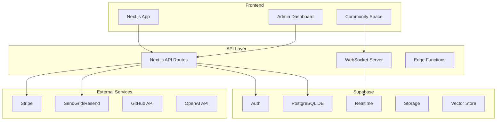

# 10 - Backend Architecture & Supabase Integration

## Complete Backend Architecture

### System Overview


## Database Schema

### Core Tables
```sql
-- Users table (extends Supabase auth.users)
CREATE TABLE public.profiles (
  id UUID PRIMARY KEY REFERENCES auth.users(id) ON DELETE CASCADE,
  username VARCHAR(50) UNIQUE,
  full_name VARCHAR(255),
  avatar_url TEXT,
  bio TEXT,
  company VARCHAR(255),
  location VARCHAR(255),
  website TEXT,
  github_username VARCHAR(100),
  twitter_handle VARCHAR(100),
  subscription_tier VARCHAR(50) DEFAULT 'free', -- free, pro, enterprise
  subscription_status VARCHAR(50) DEFAULT 'active',
  stripe_customer_id VARCHAR(255),
  metadata JSONB DEFAULT '{}',
  created_at TIMESTAMP DEFAULT NOW(),
  updated_at TIMESTAMP DEFAULT NOW()
);

-- Projects table
CREATE TABLE projects (
  id UUID PRIMARY KEY DEFAULT gen_random_uuid(),
  user_id UUID REFERENCES profiles(id) ON DELETE CASCADE,
  name VARCHAR(255) NOT NULL,
  description TEXT,
  type VARCHAR(100),
  status VARCHAR(50) DEFAULT 'active', -- active, archived, deleted
  tech_stack TEXT[],
  github_repo TEXT,
  thumbnail_url TEXT,
  settings JSONB DEFAULT '{}',
  stats JSONB DEFAULT '{}', -- lines_of_code, file_count, etc.
  created_at TIMESTAMP DEFAULT NOW(),
  updated_at TIMESTAMP DEFAULT NOW(),
  last_accessed_at TIMESTAMP DEFAULT NOW()
);

-- Project collaborators
CREATE TABLE project_collaborators (
  id UUID PRIMARY KEY DEFAULT gen_random_uuid(),
  project_id UUID REFERENCES projects(id) ON DELETE CASCADE,
  user_id UUID REFERENCES profiles(id) ON DELETE CASCADE,
  role VARCHAR(50) DEFAULT 'viewer', -- owner, editor, viewer
  permissions JSONB DEFAULT '{}',
  invited_by UUID REFERENCES profiles(id),
  invited_at TIMESTAMP DEFAULT NOW(),
  accepted_at TIMESTAMP,
  UNIQUE(project_id, user_id)
);

-- Agent executions tracking
CREATE TABLE agent_executions (
  id UUID PRIMARY KEY DEFAULT gen_random_uuid(),
  project_id UUID REFERENCES projects(id) ON DELETE CASCADE,
  user_id UUID REFERENCES profiles(id),
  agent_type VARCHAR(100) NOT NULL,
  command VARCHAR(255),
  input_tokens INTEGER DEFAULT 0,
  output_tokens INTEGER DEFAULT 0,
  tokens_saved INTEGER DEFAULT 0,
  execution_time_ms INTEGER,
  status VARCHAR(50), -- running, completed, failed
  error_message TEXT,
  metadata JSONB DEFAULT '{}',
  created_at TIMESTAMP DEFAULT NOW(),
  completed_at TIMESTAMP
);

-- Usage tracking
CREATE TABLE usage_metrics (
  id UUID PRIMARY KEY DEFAULT gen_random_uuid(),
  user_id UUID REFERENCES profiles(id) ON DELETE CASCADE,
  metric_type VARCHAR(100), -- api_calls, tokens_used, projects_created
  value INTEGER DEFAULT 0,
  period_start DATE NOT NULL,
  period_end DATE NOT NULL,
  metadata JSONB DEFAULT '{}',
  created_at TIMESTAMP DEFAULT NOW(),
  UNIQUE(user_id, metric_type, period_start, period_end)
);
```

### Community Tables
```sql
-- Community channels
CREATE TABLE community_channels (
  id UUID PRIMARY KEY DEFAULT gen_random_uuid(),
  name VARCHAR(100) NOT NULL,
  description TEXT,
  category VARCHAR(100),
  type VARCHAR(50) DEFAULT 'text', -- text, voice, forum
  is_private BOOLEAN DEFAULT false,
  is_locked BOOLEAN DEFAULT false, -- admin-only posting
  position INTEGER DEFAULT 0,
  permissions JSONB DEFAULT '{}',
  created_at TIMESTAMP DEFAULT NOW()
);

-- Messages
CREATE TABLE messages (
  id UUID PRIMARY KEY DEFAULT gen_random_uuid(),
  channel_id UUID REFERENCES community_channels(id) ON DELETE CASCADE,
  user_id UUID REFERENCES profiles(id),
  parent_id UUID REFERENCES messages(id), -- for threads
  content TEXT NOT NULL,
  content_type VARCHAR(50) DEFAULT 'text', -- text, code, image
  attachments JSONB DEFAULT '[]',
  reactions JSONB DEFAULT '{}', -- {"👍": ["user_id1", "user_id2"]}
  edited_at TIMESTAMP,
  deleted_at TIMESTAMP,
  created_at TIMESTAMP DEFAULT NOW()
);

-- Forum posts
CREATE TABLE forum_posts (
  id UUID PRIMARY KEY DEFAULT gen_random_uuid(),
  channel_id UUID REFERENCES community_channels(id) ON DELETE CASCADE,
  author_id UUID REFERENCES profiles(id),
  title VARCHAR(255) NOT NULL,
  content TEXT NOT NULL,
  tags TEXT[],
  is_pinned BOOLEAN DEFAULT false,
  is_locked BOOLEAN DEFAULT false,
  view_count INTEGER DEFAULT 0,
  reply_count INTEGER DEFAULT 0,
  last_reply_at TIMESTAMP,
  metadata JSONB DEFAULT '{}',
  created_at TIMESTAMP DEFAULT NOW(),
  updated_at TIMESTAMP DEFAULT NOW()
);

-- Forum replies
CREATE TABLE forum_replies (
  id UUID PRIMARY KEY DEFAULT gen_random_uuid(),
  post_id UUID REFERENCES forum_posts(id) ON DELETE CASCADE,
  author_id UUID REFERENCES profiles(id),
  content TEXT NOT NULL,
  is_solution BOOLEAN DEFAULT false,
  reactions JSONB DEFAULT '{}',
  edited_at TIMESTAMP,
  deleted_at TIMESTAMP,
  created_at TIMESTAMP DEFAULT NOW()
);
```

### Content & Blog Tables
```sql
-- Blog posts
CREATE TABLE blog_posts (
  id UUID PRIMARY KEY DEFAULT gen_random_uuid(),
  author_id UUID REFERENCES profiles(id),
  slug VARCHAR(255) UNIQUE NOT NULL,
  title VARCHAR(255) NOT NULL,
  excerpt TEXT,
  content JSONB NOT NULL, -- Structured content blocks
  featured_image TEXT,
  status VARCHAR(50) DEFAULT 'draft', -- draft, published, archived
  tags TEXT[],
  seo_meta JSONB DEFAULT '{}',
  view_count INTEGER DEFAULT 0,
  reading_time INTEGER, -- in minutes
  published_at TIMESTAMP,
  created_at TIMESTAMP DEFAULT NOW(),
  updated_at TIMESTAMP DEFAULT NOW()
);

-- Blog revisions
CREATE TABLE blog_revisions (
  id UUID PRIMARY KEY DEFAULT gen_random_uuid(),
  post_id UUID REFERENCES blog_posts(id) ON DELETE CASCADE,
  author_id UUID REFERENCES profiles(id),
  content JSONB NOT NULL,
  change_summary TEXT,
  created_at TIMESTAMP DEFAULT NOW()
);

-- Documentation pages
CREATE TABLE documentation (
  id UUID PRIMARY KEY DEFAULT gen_random_uuid(),
  slug VARCHAR(255) UNIQUE NOT NULL,
  parent_id UUID REFERENCES documentation(id),
  title VARCHAR(255) NOT NULL,
  content JSONB NOT NULL,
  category VARCHAR(100),
  position INTEGER DEFAULT 0,
  version VARCHAR(50),
  is_published BOOLEAN DEFAULT true,
  search_content TEXT, -- Denormalized for full-text search
  created_at TIMESTAMP DEFAULT NOW(),
  updated_at TIMESTAMP DEFAULT NOW()
);
```

### Security & Moderation Tables
```sql
-- Audit logs
CREATE TABLE audit_logs (
  id UUID PRIMARY KEY DEFAULT gen_random_uuid(),
  user_id UUID REFERENCES profiles(id),
  action VARCHAR(255) NOT NULL,
  resource_type VARCHAR(100),
  resource_id UUID,
  ip_address INET,
  user_agent TEXT,
  metadata JSONB DEFAULT '{}',
  created_at TIMESTAMP DEFAULT NOW()
);

-- Bot detection
CREATE TABLE bot_detection (
  id UUID PRIMARY KEY DEFAULT gen_random_uuid(),
  ip_address INET NOT NULL,
  user_agent TEXT,
  request_pattern JSONB,
  confidence_score FLOAT,
  is_blocked BOOLEAN DEFAULT false,
  blocked_until TIMESTAMP,
  created_at TIMESTAMP DEFAULT NOW()
);

-- Content moderation
CREATE TABLE moderation_queue (
  id UUID PRIMARY KEY DEFAULT gen_random_uuid(),
  content_type VARCHAR(100), -- message, post, comment
  content_id UUID,
  reported_by UUID REFERENCES profiles(id),
  reason VARCHAR(255),
  status VARCHAR(50) DEFAULT 'pending', -- pending, approved, removed
  moderator_id UUID REFERENCES profiles(id),
  moderation_notes TEXT,
  created_at TIMESTAMP DEFAULT NOW(),
  resolved_at TIMESTAMP
);

-- Profanity filter patterns
CREATE TABLE profanity_patterns (
  id UUID PRIMARY KEY DEFAULT gen_random_uuid(),
  pattern TEXT NOT NULL,
  severity VARCHAR(50), -- low, medium, high
  action VARCHAR(50), -- warn, block, shadowban
  created_at TIMESTAMP DEFAULT NOW()
);
```

## Supabase Configuration

### Row Level Security (RLS) Policies
```sql
-- Enable RLS on all tables
ALTER TABLE profiles ENABLE ROW LEVEL SECURITY;
ALTER TABLE projects ENABLE ROW LEVEL SECURITY;
ALTER TABLE messages ENABLE ROW LEVEL SECURITY;

-- Profiles policies
CREATE POLICY "Public profiles are viewable by everyone"
  ON profiles FOR SELECT
  USING (true);

CREATE POLICY "Users can update own profile"
  ON profiles FOR UPDATE
  USING (auth.uid() = id);

-- Projects policies
CREATE POLICY "Users can view own projects"
  ON projects FOR SELECT
  USING (auth.uid() = user_id OR 
    EXISTS (
      SELECT 1 FROM project_collaborators 
      WHERE project_id = projects.id 
      AND user_id = auth.uid()
    )
  );

CREATE POLICY "Users can create projects"
  ON projects FOR INSERT
  WITH CHECK (auth.uid() = user_id);

-- Messages policies
CREATE POLICY "Authenticated users can view messages"
  ON messages FOR SELECT
  USING (auth.uid() IS NOT NULL);

CREATE POLICY "Authenticated users can send messages"
  ON messages FOR INSERT
  WITH CHECK (auth.uid() = user_id);
```

### Realtime Subscriptions
```typescript
// Supabase client setup
import { createClient } from '@supabase/supabase-js'

const supabase = createClient(
  process.env.NEXT_PUBLIC_SUPABASE_URL!,
  process.env.NEXT_PUBLIC_SUPABASE_ANON_KEY!
)

// Real-time chat subscription
const chatSubscription = supabase
  .channel('public:messages')
  .on(
    'postgres_changes',
    { 
      event: 'INSERT', 
      schema: 'public', 
      table: 'messages',
      filter: `channel_id=eq.${channelId}`
    },
    (payload) => {
      handleNewMessage(payload.new)
    }
  )
  .subscribe()

// Real-time presence
const presenceChannel = supabase.channel('presence')
presenceChannel
  .on('presence', { event: 'sync' }, () => {
    const state = presenceChannel.presenceState()
    updateOnlineUsers(state)
  })
  .subscribe(async (status) => {
    if (status === 'SUBSCRIBED') {
      await presenceChannel.track({
        user_id: user.id,
        online_at: new Date().toISOString(),
      })
    }
  })
```

### Edge Functions
```typescript
// supabase/functions/send-newsletter/index.ts
import { serve } from 'https://deno.land/std@0.168.0/http/server.ts'
import { createClient } from 'https://esm.sh/@supabase/supabase-js@2'

serve(async (req) => {
  const { campaignId } = await req.json()
  
  const supabase = createClient(
    Deno.env.get('SUPABASE_URL')!,
    Deno.env.get('SUPABASE_SERVICE_ROLE_KEY')!
  )
  
  // Get campaign and subscribers
  const { data: campaign } = await supabase
    .from('newsletter_campaigns')
    .select('*')
    .eq('id', campaignId)
    .single()
  
  const { data: subscribers } = await supabase
    .from('newsletter_subscribers')
    .select('*')
    .eq('status', 'active')
  
  // Send emails via SendGrid/Resend
  for (const subscriber of subscribers) {
    await sendEmail(subscriber, campaign)
  }
  
  return new Response(
    JSON.stringify({ success: true }),
    { headers: { 'Content-Type': 'application/json' } }
  )
})
```

## API Routes (Next.js)

### Project Management API
```typescript
// app/api/projects/route.ts
import { createRouteHandlerClient } from '@supabase/auth-helpers-nextjs'
import { cookies } from 'next/headers'

export async function GET() {
  const supabase = createRouteHandlerClient({ cookies })
  
  const { data: { user } } = await supabase.auth.getUser()
  if (!user) {
    return Response.json({ error: 'Unauthorized' }, { status: 401 })
  }
  
  const { data: projects } = await supabase
    .from('projects')
    .select('*')
    .eq('user_id', user.id)
    .order('updated_at', { ascending: false })
  
  return Response.json({ projects })
}

export async function POST(request: Request) {
  const supabase = createRouteHandlerClient({ cookies })
  const body = await request.json()
  
  const { data: { user } } = await supabase.auth.getUser()
  if (!user) {
    return Response.json({ error: 'Unauthorized' }, { status: 401 })
  }
  
  const { data: project, error } = await supabase
    .from('projects')
    .insert({
      ...body,
      user_id: user.id
    })
    .select()
    .single()
  
  if (error) {
    return Response.json({ error: error.message }, { status: 400 })
  }
  
  return Response.json({ project })
}
```

### WebSocket Server (for real-time features)
```typescript
// server/websocket.ts
import { Server } from 'socket.io'
import { createClient } from '@supabase/supabase-js'

const io = new Server({
  cors: {
    origin: process.env.NEXT_PUBLIC_APP_URL,
    credentials: true
  }
})

io.on('connection', async (socket) => {
  const token = socket.handshake.auth.token
  
  // Verify user with Supabase
  const supabase = createClient(
    process.env.SUPABASE_URL!,
    process.env.SUPABASE_ANON_KEY!,
    {
      global: {
        headers: {
          Authorization: `Bearer ${token}`
        }
      }
    }
  )
  
  const { data: { user } } = await supabase.auth.getUser()
  if (!user) {
    socket.disconnect()
    return
  }
  
  // Join user to their channels
  socket.join(`user:${user.id}`)
  
  // Handle messages
  socket.on('message:send', async (data) => {
    const message = await saveMessage(data)
    io.to(`channel:${data.channelId}`).emit('message:new', message)
  })
  
  // Handle typing indicators
  socket.on('typing:start', (channelId) => {
    socket.to(`channel:${channelId}`).emit('user:typing', {
      userId: user.id,
      channelId
    })
  })
})
```

## Authentication Flow

### Supabase Auth Configuration
```typescript
// lib/auth.ts
export const authOptions = {
  providers: [
    // Email/Password
    email: {
      enabled: true,
      confirmEmail: true,
      passwordMinLength: 8
    },
    // OAuth Providers
    github: {
      enabled: true,
      clientId: process.env.GITHUB_CLIENT_ID,
      clientSecret: process.env.GITHUB_CLIENT_SECRET
    },
    google: {
      enabled: true,
      clientId: process.env.GOOGLE_CLIENT_ID,
      clientSecret: process.env.GOOGLE_CLIENT_SECRET
    }
  ],
  // Email templates
  emailTemplates: {
    confirmEmail: {
      subject: 'Welcome to Agentwise!',
      content: 'Please confirm your email...'
    },
    resetPassword: {
      subject: 'Reset your Agentwise password',
      content: 'Click here to reset...'
    }
  }
}
```

## Caching Strategy

### Redis/Upstash Integration
```typescript
// lib/cache.ts
import { Redis } from '@upstash/redis'

const redis = new Redis({
  url: process.env.UPSTASH_REDIS_REST_URL!,
  token: process.env.UPSTASH_REDIS_REST_TOKEN!,
})

export async function getCachedData<T>(
  key: string,
  fetcher: () => Promise<T>,
  ttl: number = 3600
): Promise<T> {
  const cached = await redis.get(key)
  if (cached) return cached as T
  
  const fresh = await fetcher()
  await redis.set(key, fresh, { ex: ttl })
  
  return fresh
}
```

---

**Note**: This backend architecture provides a scalable, secure foundation with real-time capabilities, comprehensive tracking, and efficient caching strategies.